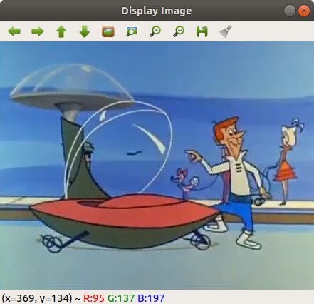

#### Build instructions
```bash
$ mkdir build && cd build
$ cmake -DCMAKE_BUILD_TYPE=Release ..
$ make
```

#### Run instructions
Executable file will be generated in the `/build` sub-directory
```bash
$ ./display_image 
```

##### Output


